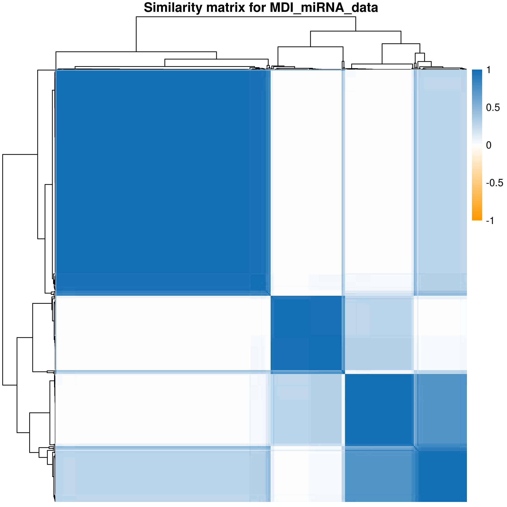

```{r setup, include=FALSE}
knitr::opts_chunk$set(echo = TRUE)
```

## Summary

* I have added a Gaussian mixture option to Paul's MATLAB code.
* I have run this model on the BCC TCGA data. This consists of 4 datasets for breast cancer from the TCGA. Gene expression, protein, methylation and miRNA data.
  * I have followed the pre-processing from the paper and then mean-centred and standardised the variance before running MDI (due to prior assuming a standard normal).

## Gaussian mixture model

The MATLAB code assumes a standard normal distribution with exchangability of variables (i.e. independence of variables). The code uses a collapsed Gibbs sampler. This means that instead of calculating the probability of membership via:

\[
p(z_i = k | z_{-i}, x_i, \pi_k, \theta_k) \propto \pi_k f(x_i | \theta_k)
\]

one must compare the marginal likelihoods. In this case as the $\pi_k$ and $\theta_k$ are not sampled one uses:

\[
\begin{aligned}
p(z_i = k | z_{-i}, x_i, \pi_k, \theta_k) &\propto \pi_k \int f(x|\theta) p(\theta) d\theta \\
  &= \pi_k F(x)
\end{aligned}
\]

Here $F(x)$ is the marginal likelihood. One computes the marginal likelihood for the model considering all allocations except that of the $i^{th}$, $F(x_{-i})$ (call this the marginal likelihood for the **excluded model**). One then considers the ratio of marginal likelihoods for proposed model with $z_i = k$ and the excluded model; this enables comparison of models as the ratio in the above equation moves to an equality.

This is what the MATLAB code implements.

## BCC data pre-processing

The pre-processing from the BCC paper involves the following steps:

  * Gene expression data:
    1. impute missing values using `impute.knn` from the `impute` Bioconductor package;
    2. select only the genes with a standard deviation greater than 1.
  * Methylation data:
    1. Remove rows with missing values in more than 50% of entries;
    2. Take the square root of the remaining values.
  * miRNA data:
    1. Take the `log` of the data.
  * Protein data:
    1. Mean centre and standardise (in original paper separate to MDI requirements).

## BCC data analysis

I have applied consensus inference to the data with 1,000 seeds for 500 iterations and both of 50 and 250 components (as a maximum). The number of components had no impact upon the results. I have to compare the clustering to the labels proposed by TGCA. TGCA has 4 prominent types; I have to find the labels for these but there's some encouraging result in that 4 clusters emerge from the miRNA dataset:



    