```{r setup, include=FALSE}
knitr::opts_chunk$set(echo = TRUE)
```

## Summary

* I have looked at the BCC TCGA data pre- and post-processing.
* I have gone through the maths of a collapsed gibbs sampler and annotated the function that draws new item labels in Paul's code.
* Talked with Eckart.

## BCC data processing

I looked at a UMAP reduction of the data and from this labelled the data based on their UMAP coordinates (this should correspond to clustering sturcture). I then view a plot of the principal components (PCs) of each dataset pre- and post-processing with the points labelled based on the UMAP coordinates (the UMAP coordinates changed only slightly due to the processing except in the case of the gene expression and methylation data where points were actively removed). As a reminder, the processing steps were:

* Gene expression data:
    1. impute missing values using `impute.knn` from the `impute` Bioconductor package;
    2. select only the genes with a standard deviation greater than 1.
  * Methylation data:
    1. Remove rows with missing values in more than 50% of entries;
    2. Take the square root of the remaining values.
  * miRNA data:
    1. Take the `log` of the data.
  * Protein data:
    1. Mean centre and standardise (in original paper separate to MDI requirements).

### Gene expression data


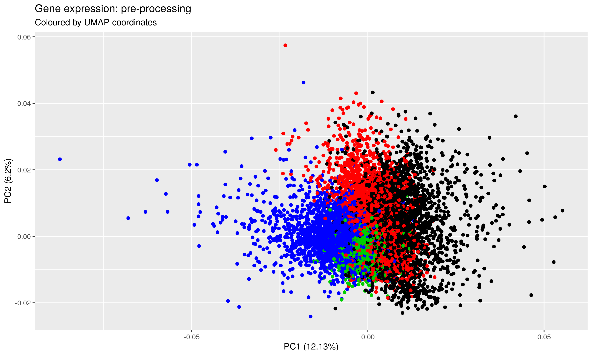

    
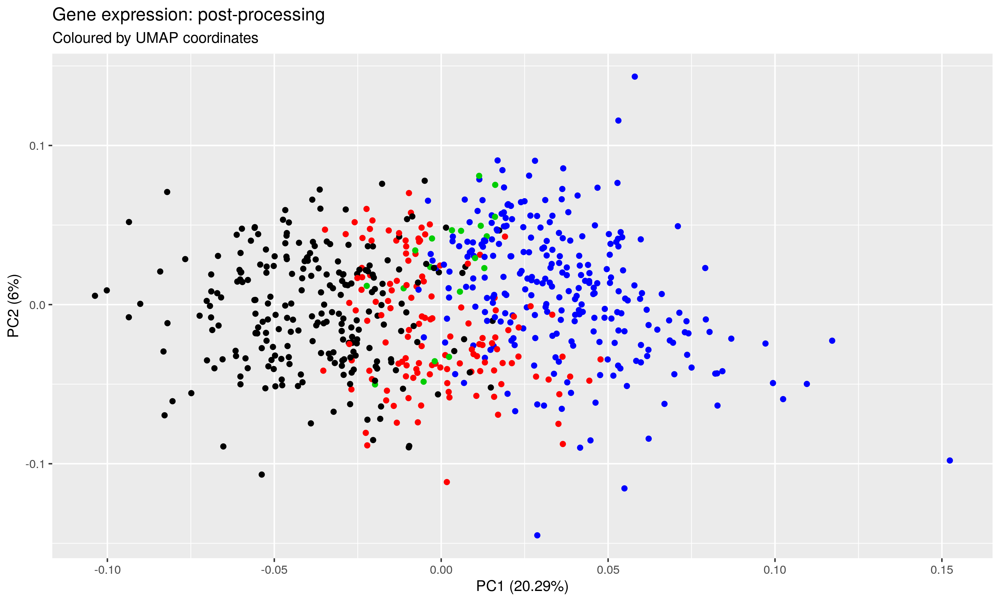


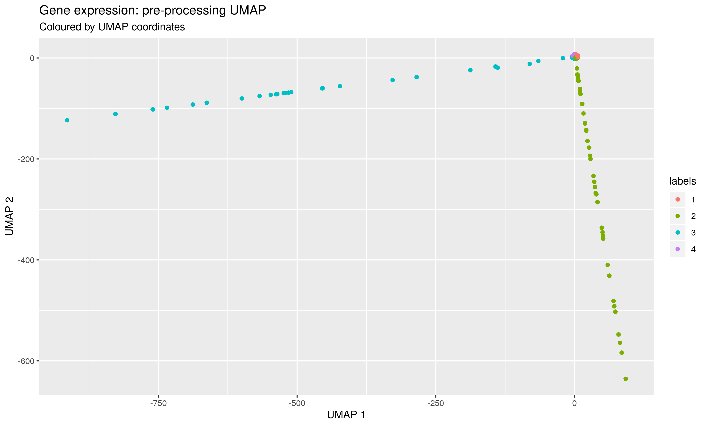


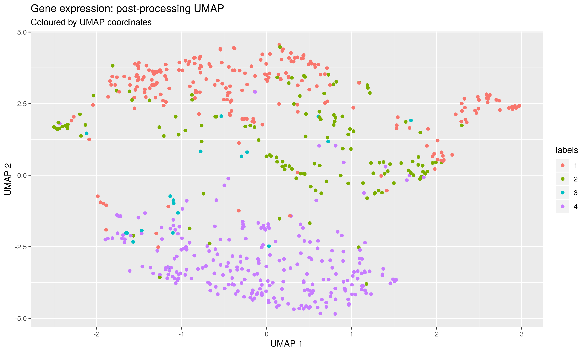


### Methylation data


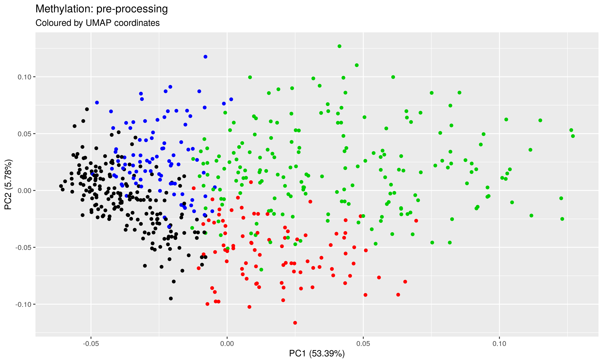

    
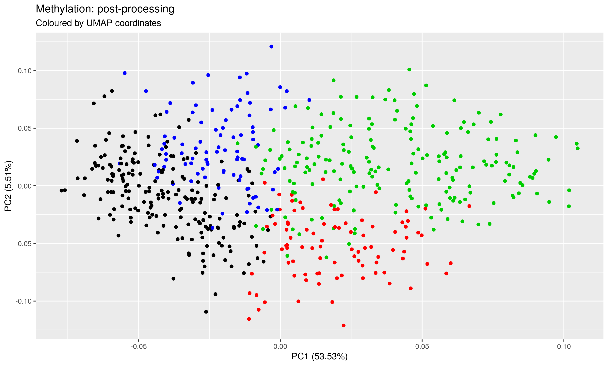


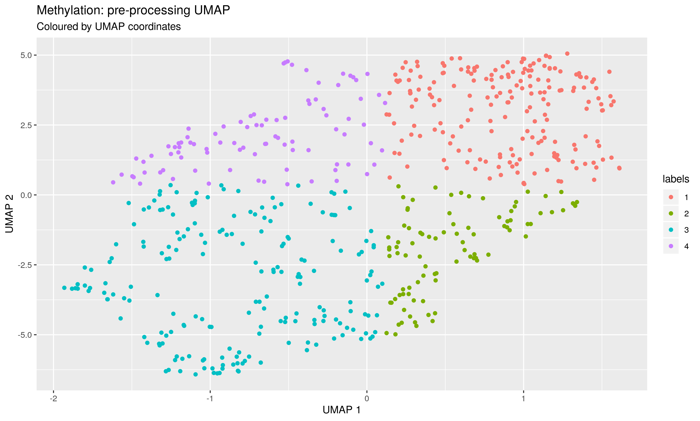


### miRNA data

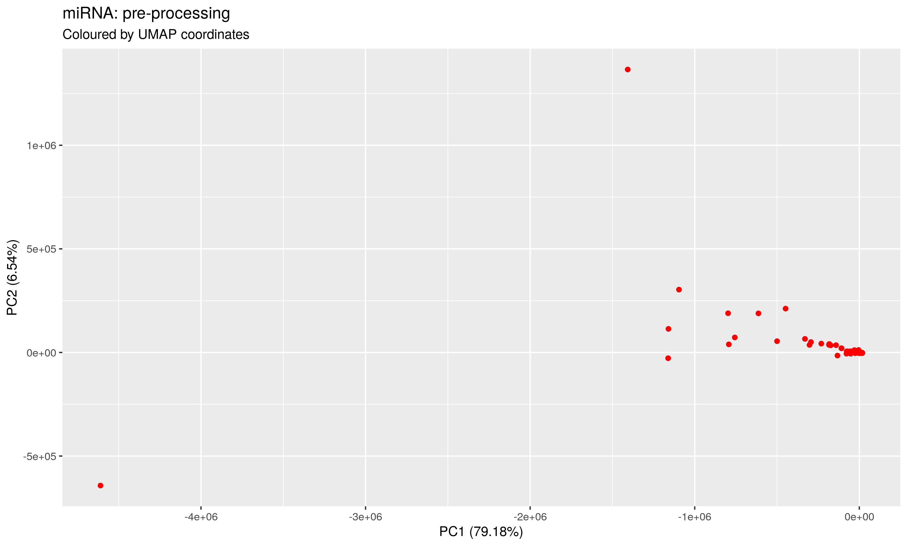

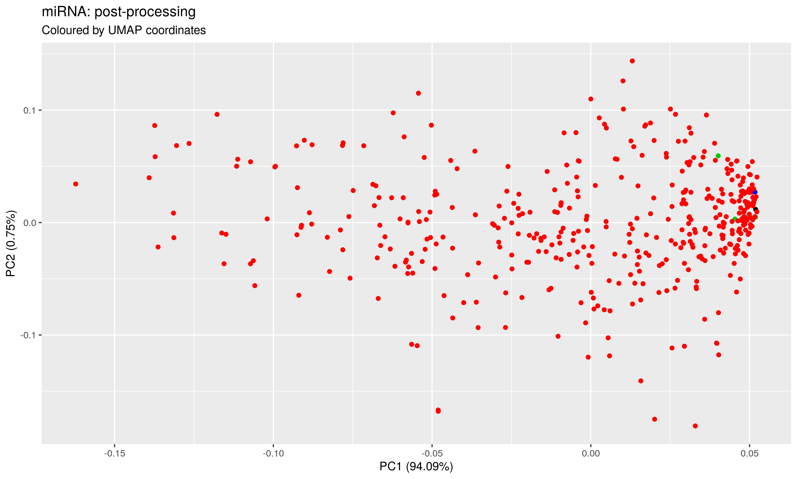

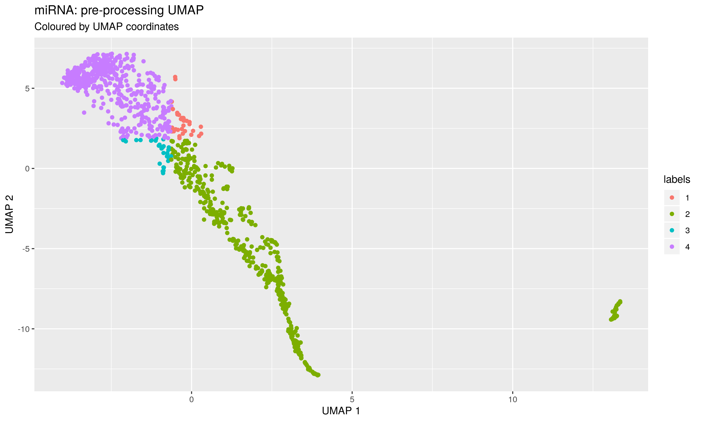

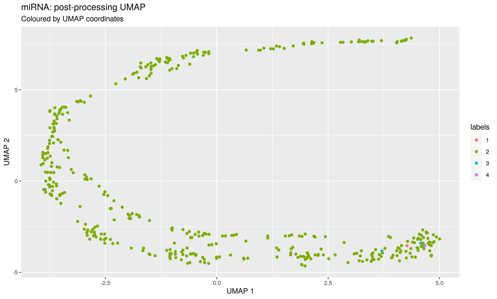

### Protein data

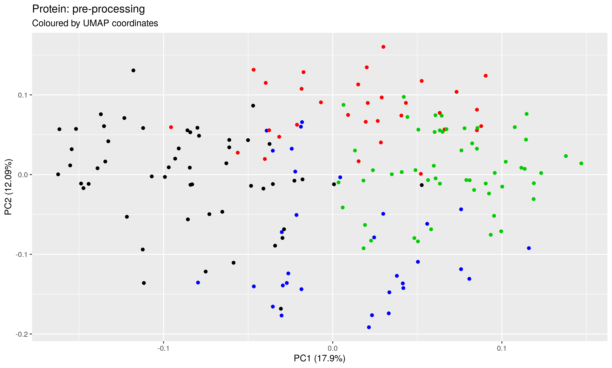

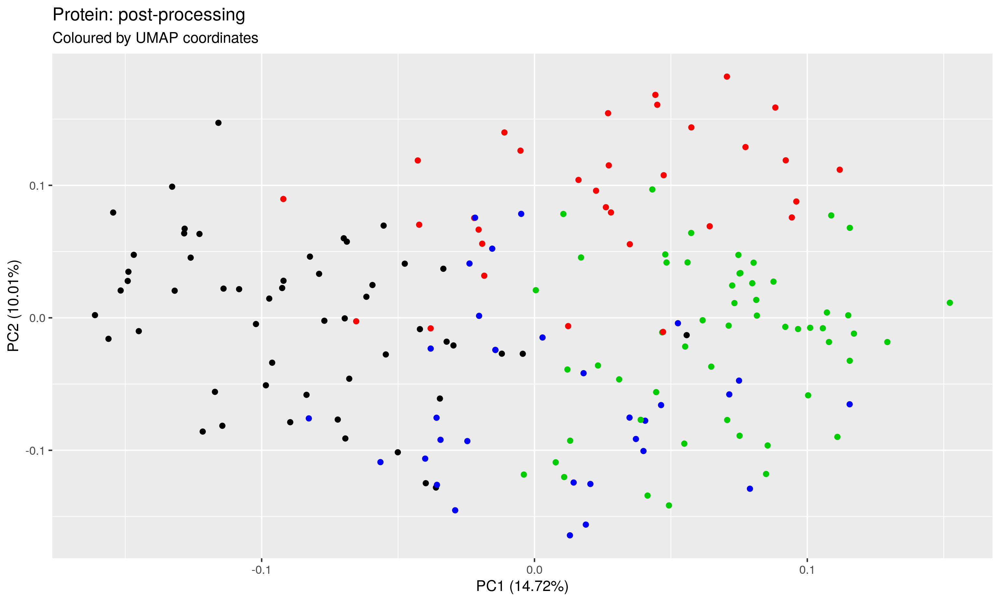

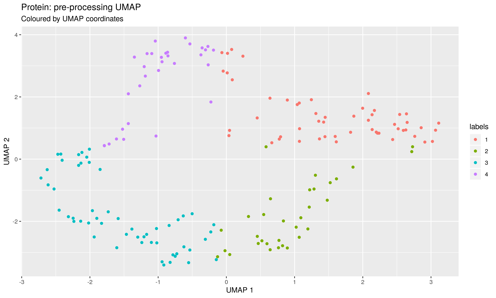
