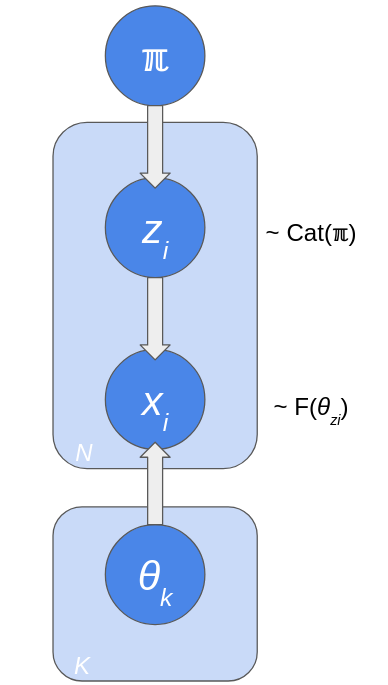

```{r setup, include=FALSE}
knitr::opts_chunk$set(echo = TRUE)
```
## Collapsed Gibbs sampling

First recall that:

\[
\begin{aligned}
p(A, B | C) &= p(B | A, C) p (A | C) \\
p(A|B, C) &= \frac{p(A, B | C)}{P(B|C)} \\
  &= \frac{p(B | A, C) p (A | C)}{P(B|C)}
\end{aligned}
\]

Consider Gibbs sampling of some vector of variables $\theta=(\theta_1,\ldots,\theta_p)$. Gibbs sampling works by iterating over each variable to be predicted, updating it based upon the current values of all the other variables and then repeating this a large number of times. Let $\theta^{(j)}=(\theta^{(j)}_1,\ldots,\theta^{(j)}_n)$ be the predicted values of $\theta$ in the $j^{th}$ iteration of Gibbs sampling. Our update for $\theta^{(j)}_i$ is conditioned on all the current values for the other variables - this means that the first $(i-1)$ variables have already been updated $j$ times, but the remaining $p - i$ variables are still baased upon the $(j-1)^{th}$ iteration, i.e. our update probability is of the form:

\[
p\left(\theta^{(j)}_i | \theta^{(j)}_1,\ldots,\theta^{(j)}_{i-1},\theta^{(j-1)}_{i+1},\ldots, \theta^{(j - 1)}_p\right)
\]

Now, consider Gibbs sampling for a mixture of $K$ components for data $x=(x_1, \ldots, x_n)$, allocation variables $z=(z_,1\ldots,z_n)$, component parameters $\theta=(\theta_1,\ldots,\theta_K)$, and component weights $\pi=(\pi_1,\ldots,\pi_K)$. Let $x_{-i}$ indicate the vector $(x_1,\ldots,x_{i-1},x_{i+1},ldots,x_n)$ and similarly for $z_{-i}$. Let




\[
\begin{aligned}
p(z_i = k | x, z_{-i}, \gamma) &= \frac{p(z_i = k | \gamma) p(x_i | z, x_{-i})}{p(x_i, z_{-i})} \\
  &\propto \gamma_k \int_{\theta} p(x_i | \theta) p(\theta | z, x_{-i}) d \theta \\
\end{aligned}
\]

Note that the denominator is independent of the current allocation (and thus is the same regardless of $k$). This is the posterior predictive probability of $x_i$ belonging to the $k^{th}$ component given the points assigned to this component, which is the ratio of marginal likelihoods for the component model with and the component model without gene $x_i$. Thus:

\[
p(z_i = k | x, z_{-i}, \gamma) \propto \gamma_k \frac{Z'}{Z}(2\pi)^{-\frac{1}{2}}
\]


## What is the Marginal likelihood?

As we are considering a specific component:

\[
\begin{aligned}
p(x | z_i = k, z_{-i}) &= \int_\theta p(x | \theta, z_i = k, z_{-i}) p(\theta | z_i = k, z_{-i}) d \theta
\end{aligned}
\]

Let $F_k(z)$ be the marginal likelihood for a given component. Then:

\[
\frac{F_k(z)}{F_k(z_{-i})} = 
\]